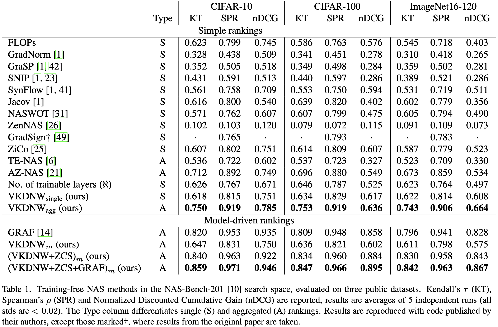

# Training-free Neural Architecture Search through Variance of Knowledge of Deep Network Weights

**Official repository of the paper presented at CVPR 2025**

**Authors**: [Ondřej Týbl](https://fel.cvut.cz/en/faculty/people/33156-ondrej-tybl) [Lukáš Neumann](https://cmp.felk.cvut.cz/~neumann/projects.html)

**Paper**: [CVPR2025](https://openaccess.thecvf.com/content/CVPR2025/papers/Tybl_Training-free_Neural_Architecture_Search_through_Variance_of_Knowledge_of_Deep_CVPR_2025_paper.pdf)

We are proud members of the [VRG at Czech Technical University in Prague](https://vrg.fel.cvut.cz). Join us if you are interested in cutting-edge research in neural networks and computer vision! [Click for more info.](https://cmp.felk.cvut.cz/~neumann/projects.html)


## Abstract

Deep learning has revolutionized computer vision, but it achieved its tremendous success using deep network architectures which are mostly hand-crafted and therefore
likely suboptimal. Neural Architecture Search (NAS) aims
to bridge this gap by following a well-defined optimization
paradigm which systematically looks for the best architecture, given objective criterion such as maximal classification accuracy. The main limitation of NAS is however its
astronomical computational cost, as it typically requires
training each candidate network architecture from scratch.
In this paper, we aim to alleviate this limitation by
proposing a novel training-free proxy for image classification accuracy based on Fisher Information. The proposed
proxy has a strong theoretical background in statistics and
it allows estimating expected image classification accuracy
of a given deep network without training the network, thus
significantly reducing computational cost of standard NAS
algorithms.
Our training-free proxy achieves state-of-the-art results
on three public datasets and in two search spaces, both
when evaluated using previously proposed metrics, as well
as using a new metric that we propose which we demonstrate is more informative for practical NAS applications.

## Method
- Training-free NAS proxy called \textit{Variance of Knowledge of Deep Network Weights (VKDNW)}.
- Strong theoretical support and achieved state-of-the-art results on three public datasets and in two search spaces.
- VKDNW provides information orthogonal to network size unlike previous methods (this helps to easily factor the network performance into \textit{size} and \textit{shape} proxies).
- Zero-cost network ranking where contributions of network size and architectural feasibility are separated.
- We demonstrated that previously used correlation metrics for proxy evaluation do not sufficiently assess the key ability to discriminate top networks.
- To address this, we proposed a new evaluation metric Normalized Discounted Cumulative Gain (nDCG).

## Results




## Install and run

Clone the repository
```
git clone https://github.com/ondratybl/VKDNW.git
```
Install the requirements:
```
cd VKDNW
conda env create -f environment.yml
```
For the NAS-Bench-201 search space, prepare the API file from [NATS-Bench](https://github.com/D-X-Y/NATS-Bench) (e.g., ```./api_data/NATS-tss-v1_0-3ffb9-simple```) and run ```tss_general_.py``` for experiments.

For the MobileNetV2 search space, prepare the ImageNet dataset and change accordingly ```ImageNet_MBV2/Dataloader/__init__.py``` and run ```ImageNet_MBV2/evolution_search_vkdnw.py``` for experiments.

## Acknowledgement

The implementation is based on the following projects (please cite the corresponding papers appropriately):
- [NATS-Bench](https://github.com/D-X-Y/NATS-Bench)
- [AutoDL-Projects](https://github.com/D-X-Y/AutoDL-Projects)
- [ZenNAS](https://github.com/idstcv/ZenNAS)
- [ZiCo](https://github.com/SLDGroup/ZiCo)
- [TF_TAS](https://github.com/decemberzhou/TF_TAS)

## Citation

```
@inproceedings{tybl2025training,
  title={Training-free Neural Architecture Search through Variance of Knowledge of Deep Network Weights},
  author={Tybl, Ondrej and Neumann, Lukas},
  booktitle={Proceedings of the Computer Vision and Pattern Recognition Conference},
  pages={14881--14890},
  year={2025}
}
```
